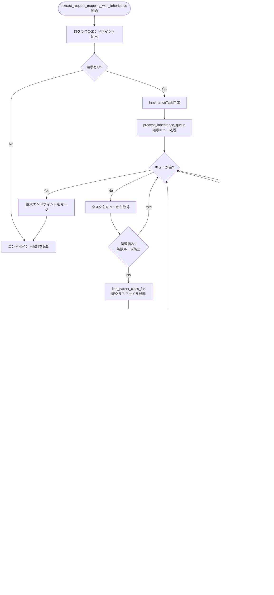

# scan-directory 処理フロー

このドキュメントでは、path-finderの`scan-directory`コマンドの詳細な処理フローを説明します。

## 概要フロー


## 詳細処理フロー

```mermaid
flowchart TD
    Start([scan_directory開始]) --> Init[all_endpoints = Vec::new<br/>初期化]
    Init --> WalkDir[WalkDir::new<br/>ディレクトリ走査開始]
    
    WalkDir --> FileCheck{ファイル?}
    FileCheck -->|No| WalkDir
    FileCheck -->|Yes| ExtCheck{拡張子判定}
    
    ExtCheck -->|.java| JavaPath[Javaファイル処理パス]
    ExtCheck -->|.kt| KotlinPath[Kotlinファイル処理パス]
    ExtCheck -->|Other| WalkDir
    
    %% Java処理パス
    JavaPath --> JavaHasRM{java::has_request_mapping<br/>@RequestMapping有り?}
    JavaHasRM -->|No| WalkDir
    JavaHasRM -->|Yes| JavaExtract[java::extract_request_mapping<br/>_with_inheritance]
    
    %% Kotlin処理パス
    KotlinPath --> KotlinHasRM{kotlin::has_request_mapping<br/>@RequestMapping有り?}
    KotlinHasRM -->|No| WalkDir
    KotlinHasRM -->|Yes| KotlinExtract[kotlin::extract_request_mapping<br/>_with_inheritance]
    
    JavaExtract --> JavaInherit[Java継承処理]
    KotlinExtract --> KotlinInherit[Kotlin継承処理]
    
    JavaInherit --> AddEndpoints[all_endpoints.extend<br/>エンドポイント追加]
    KotlinInherit --> AddEndpoints
    
    AddEndpoints --> MoreFiles{他にファイル有り?}
    MoreFiles -->|Yes| WalkDir
    MoreFiles -->|No| OutputCheck{JSON出力?}
    
    OutputCheck -->|Yes| JsonOutput[serde_json::to_string_pretty<br/>JSON変換]
    OutputCheck -->|No| VecOutput[Endpoint配列を返却]
    
    JsonOutput --> End([完了])
    VecOutput --> End
```

## 継承処理の詳細フロー



## クロス言語継承の処理


## エラーハンドリング


## 主要なデータ構造

### Endpoint
```rust
struct Endpoint {
    class_name: String,     // クラス名
    method_name: String,    // メソッド名
    http_method: String,    // HTTP動詞 (GET, POST, etc.)
    path: String,          // エンドポイントパス
    parameters: Vec<Parameter>, // パラメータ情報
    line_range: (usize, usize), // ファイル内行番号
    file_path: String,     // ファイルパス
    headers: String,       // ヘッダー情報
}
```

### InheritanceTask
```rust
struct InheritanceTask {
    child_file_path: String,    // 子クラスファイルパス
    child_class_name: String,   // 子クラス名
    child_base_path: Option<String>, // 子クラスのbase path
    parent_class_name: String,  // 親クラス名
}
```

## パフォーマンス特性

- **時間計算量**: O(n×m) (n=ファイル数, m=平均継承深度)
- **空間計算量**: O(k) (k=総エンドポイント数)
- **並列処理**: なし (シングルスレッド)
- **メモリ使用**: 全エンドポイントをメモリに保持

## 制限事項

- 循環継承の検出と防止
- Spring標準クラスの警告除外
- ファイル名とクラス名の不一致への対応
- tree-sitterパーサーの制約に依存